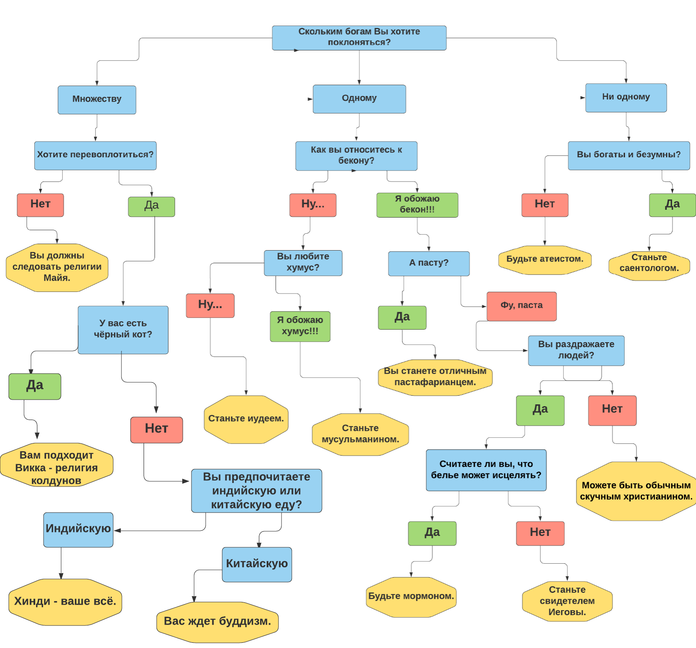
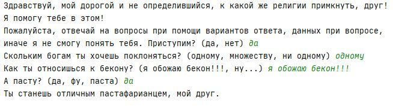
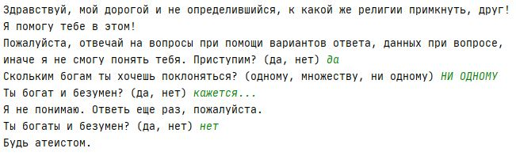
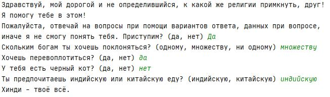
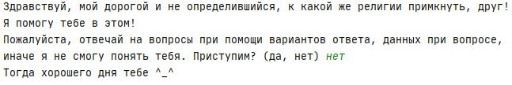

# Отчет по лабораторной работе
## по курсу "Искусственый интеллект"

### Студенты: 

| ФИО       | Роль в проекте                     | Оценка       |
|-----------|------------------------------------|--------------|
| Алексюнина Юлия, 8О-307 | Реализация оболочки ЭС на Python |          |
| Алексюнина Юлия, 8О-307 | Разработка схемы, тестирование и отладка |       |
| Алексюнина Юлия, 8О-307 | Составление базы знаний |      |
| Алексюнина Юлия, 8О-307 | Написание отчёта, etc |          |

## Результат проверки

| Преподаватель     | Дата         |  Оценка       |
|-------------------|--------------|---------------|
| Сошников Д.В. |              |               |

> *Комментарии проверяющих (обратите внимание, что более подробные комментарии возможны непосредственно в репозитории по тексту программы)*

## Тема работы

Тема работы: выбор подходящей религии для тех, кто еще с ней не определился.


Первоначально темой для ЭС был подбор ноутбука, в зависимости от предпочтений клиента. Хотя это и довольно актуальная тема, мне хотелось сделать что-то, что сможет порадовать моих одногруппников, когда я буду делиться результатами работы с ними. 

Религия, по мнению С.Н. Булгакова, представляет собой настолько универсальный факт человеческой жизни, что отрицать его невозможно.
Современная социальная среда предъявляет все более высокие требования к молодому человеку. При этом он часто не находит духовной и моральной опоры в этой среде и ищет эту опору в религии. Среди молодежи наблюдается возрастание интереса к религии, эзотериеским и экзотерическим учениям как проявление духовного поиска.

Конечно, и сейчас существуют семьи, которые поколениями следуют одной и той же религии, без права выбора новой. Но, тем не менее, все больше молодых людей задумывается самостоятельно о выборе религии, и в этом им может помочь данная ЭС, основываясь на ответах на некоторые вопросы из их жизни.

## Концептуализация предметной области

Результаты концептуализации предметной области:
 - выделенные понятия: количество богов, желание перевоплощения, предпочтение между индийской и китайской едой, наличие черного кота, отношение к бекону/пасте/хумусу, вера в исцеление посредством использования специального белья, наличие богатства. 
 - связи между ними, тип получившейся онтологии: иерархия
 - статические знания: количество богов, желание перевоплощения, предпочтение между индийской и китайской едой, наличие черного кота, отношение к бекону/пасте/хумусу, вера в исцеление посредством использования специального белья, наличие богатства.
В ходе работы над концептуализацией предметной области были выделены следующие категории веры: Христианство, Мормонизм, религия Майя, Атеизм, Саентология, Пастафарианство, Викка, Иудаизм, Мусульманство, Буддизм, Хинди(Индуизм).  


Графическая иллюстрация:



## Принцип реализации системы

Пользователю рекомендуется определенная религия, исходя из его некоторых жизненных предпочтений, которые мы узнаём путем ответа пользователя на некоторые вопросы. Например, хочет ли пользователь перевоплотиться, в какое количество богов он хочет верить, любит ли он хумус и т.д. Ответы обрабатываются, и в результате отсекаются некоторые ветки решения (если пользователь хочет верить в одного бога, то отсекаются ветки решения с количеством богов больше или меньше одного).

Для решения поставленной задачи используется язык программирования Python и библиотека experta(аналог CLIPS). Библиотека experta была выбрана мной, так как мне хотелось изучить что-то новое для себя, и я потратила некоторое время на изучение документации данной библиотеки, прежде чем приступить к написанию программы. К сожалению, мой уровень знаний не был достаточен, исходя из оставшегося времени на сдачу, чтобы связать исходную ЭС, где общение с пользователем происходит в консоли, с ботом в telegram, но я постараюсь завершить эту задачу вне сроков лабораторной. 

[Полный код программы находится здесь](https://github.com/MAILabs-Edu-AI/lab-expert-system-meow-code/blob/master/es.py)
## Механизм вывода

В программе существует определенный набор правил. В этих правилах задействованы ответы пользователя, с их помощью система выводит подходящее для конкретного пользователя решение. 

Пример правила:
```python
@Rule(Fact(action='linen_healing'),  # LH
          Fact(GN=MATCH.GN),
          Fact(RBRM=MATCH.RBRM),
          Fact(CHP=MATCH.CHP),
          Fact(FA=MATCH.FA),
          NOT(Fact(LH=W())))
    def lh(self, GN, RBRM, CHP, FA):
        if GN == 'множеству' and RBRM == 'да':
            if CHP == 'нет':
                if FA == 'индийскую':
                    print("Хинди - твоё всё.")
                if FA == 'китайскую':
                    print("Тебя ждет буддизм.")
        if GN == 'одному':
            if RBRM == 'я обожаю бекон!!!':
                if CHP == 'фу, паста':
                    if FA == 'да':
                        temp = input("Считаешь ли ты, что белье может исцелять? (да, нет) ").lower()
                        while temp != 'да' and temp != 'нет':
                            print("Я не понимаю. Ответь еще раз, пожалуйста.")
                            temp = input("Считаешь ли ты, что белье может исцелять? (да, нет) ").lower()
                        self.declare(Fact(LH=temp))
                    if FA == 'нет':
                        print("Можешь быть обычным скучным христианином.")
```
Остальной вывод организован аналогично.
Общение с пользователем происходит через консоль.

## Извлечение знаний и база знаний

Извлечение знаний происходило дома при помощи поиска в Google по известным в мире религиям, а также опроса пары моих друзей.
В результате этого была составлена графическая иллюстрация концептуализации предметной области, на основе которой и была написана ЭС.

## Протокол работы системы

Несколько примеров работы системы:









## Выводы

Экспертные системы являются хорошими помощниками в принятии выбора. Даже если пользователь в итоге не выберет предложенный системой вариант, он, как минимум, узнает что-то новое. 

Эта лабораторная работа - первая для меня по предмету "Искусственный интеллект". Написав ее, я поняла, что впереди меня ждут не менее интересные задания. За эту лабораторную работу я узнала, что существуют такие оболочки, как CLIPS, а также их аналоги, познакомилась с библиотекой experta и научилась при помощи нее писать несложную ЭС. 

Кроме этого, я почерпнула знания о различных религиях, которые существуют в мире, поскольку раньше я даже не подозревала о некоторых из них.

К сожалению, эту лабораторную мне пришлось писать одной, поскольку не было разрешено писать командой из пяти человек, а поделиться на команды по 2.5 человека. Увы, распилить человека пополам ради этой лабораторной работы мы не решились. 
Зато для второй лабораторной работы, сориентировавшись быстрее, чем в прошлый раз, я уже нашла команду, в том числе и потому, что написав эту, я поняла, что работа в команде, как минимум, гораздо интереснее и продуктивнее.
